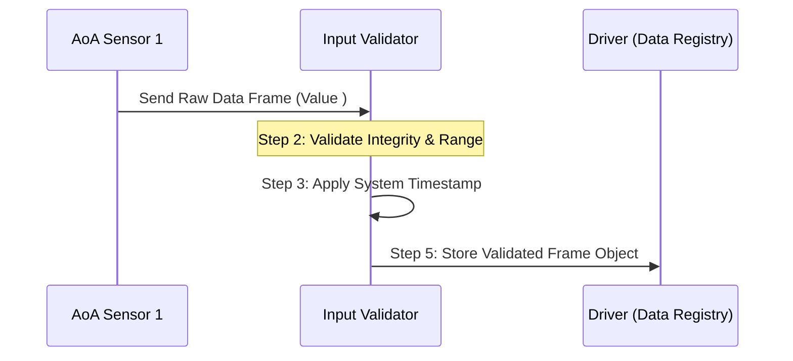
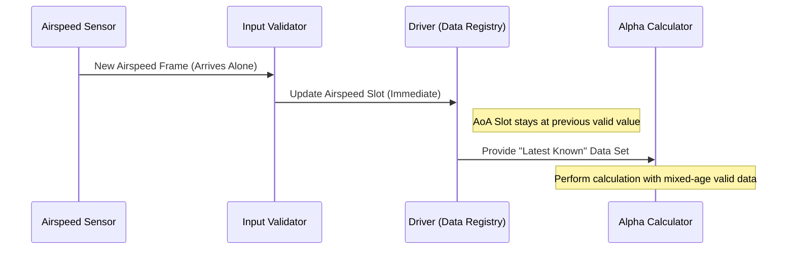

# Lab 3 – Individual Worksheet: V-Model and Traceability

> **Course:** CS G523 – Software for Embedded Systems  
> **Student Name:**  Aniket Saxena
> **Project:**  AOA Controller
> **Team:**  P-2

---

## Objective

This worksheet captures **individual reasoning** about how requirements are:
- realized through interactions (design),
- verified through tests.

This is an **individual exploratory artifact** and will be consolidated
at the group level.

---

## 1. Selected Requirements

Select **two requirements** from the finalized **group Lab 2 submission**.

| Requirement ID | Requirement (brief description) |
|----------------|---------------------------------|
| FR-1 |Input Acquisition and Validation |
| FR-2 |Asynchronous Data Handling |

---

## 2. Sequence Diagram(s)

Create **sequence diagram(s)** corresponding to the selected requirements.

- You may draw two separate diagrams, or one combined diagram if interactions overlap.
- Use **Mermaid** syntax.

### Sequence Diagram A (for FR-1)



### Sequence Diagram B (for FR-2) 



---

## 3. Test Artifacts

For **each requirement**, define **one test artifact**.

### Test for Requirement R-1
- **Setup:**
1. Initialize the InputValidator module.
2. Clear the DataRegistry (output buffer).
3. Mock a sensor input stream (e.g., a CAN bus or Serial buffer).
- **Procedure:**
1. Inject a raw frame and a value within the safety range (e.g., $10^\circ$).
2. Inject a raw frame with an out-of-bounds value (e.g., $+95^\circ$).
3. Inspect the DataRegistry after each injection. 
- **Pass criteria:**
1. The valid frame is accepted and assigned a system timestamp $\tau$.
2. The out-of-bounds frame is discarded; Logger records a "Range Violation."
3. The DataRegistry contains only the validated data.

### Test for Requirement R-2
- **Setup:**
1. Initialize InputValidator and DataRegistry.
2.  Pre-populate the registry with initial valid "Baseline" values for all sensors (AoA, Airspeed, Config).
3.  Set the system clock/cycle timer.
- **Procedure:**
1. Trigger an update for Airspeed only; do not send an update for AoA
2. Immediately trigger a "Read" from the AlphaCalculator.
3. In the next cycle, trigger an update for AoA only.
4. Inspect the data set used by the AlphaCalculator in both cycles.
   
- **Pass criteria:**
1. The system does not block or time out when the AoA frame is missing.
2. In Step 2, the system uses the New Airspeed + Baseline AoA.
3. In Step 3, the system uses the New Airspeed + New AoA.
4. The AlphaCalculator successfully executes using the "Most Recently Received Valid" values.

---

## Reflection (Optional)

Briefly note any ambiguity or difficulty in mapping requirement → interaction → test.
```


```
